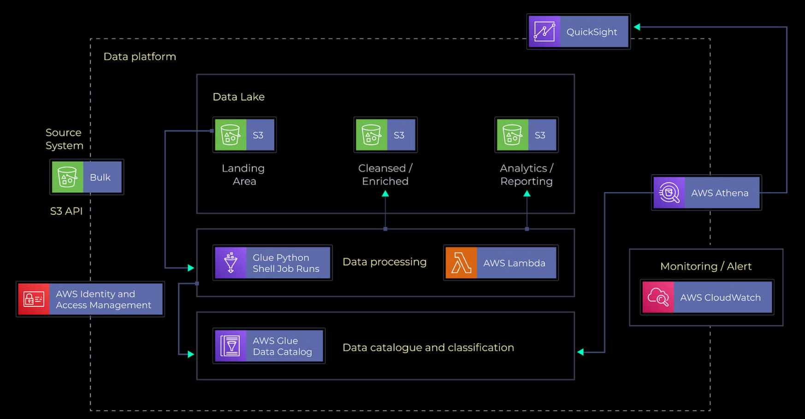

# Youtube-Data-Engineering-Pipeline 📺
## 📝 Overview
Embark on a transformative journey with the YouTube Data Engineering Pipeline repository! This project offers a robust solution meticulously crafted to efficiently manage, process, and analyze YouTube video data leveraging the power of AWS services. Whether you're diving into structured statistics or exploring the nuances of trending key metrics, this pipeline is engineered to handle it all with finesse.

## 🎯 Pipeline Goals
- **Data Ingestion**: Forge a resilient data ingestion mechanism capable of harmonizing data from disparate sources, prioritizing reliability.
- **ETL Excellence**: Engineer an Extract, Transform, Load (ETL) system to streamline the transformation of raw data into a standardized format.
- **Data Lake Mastery**: Establish a centralized data repository leveraging Amazon S3, ensuring optimal efficiency in housing diverse datasets.
- **Scalability**: Architect the system to seamlessly scale alongside burgeoning data volumes, guaranteeing uninterrupted performance.
- **Cloud Empowerment**: Harness the prowess of AWS cloud infrastructure to efficiently process and analyze extensive datasets.
- **Insightful Reporting**: Craft interactive dashboards in Amazon QuickSight, for visualization & analysis to drive informed decision-making.

## 📂 Dataset
The project utilizes a Kaggle dataset containing statistics on daily popular YouTube videos. 
- There are up to 200 trending videos published every day for many locations. 
- The data for each region is in its own file.
  
Each file includes metadata such as video title, channel title, publication time, tags, views, likes, dislikes, description, comment count, and category ID. The data also includes a category_id field, which varies between regions. To retrieve the categories for a specific video, find it in the associated JSON. One such file is included for each of the regions in the dataset. This dataset is been updated daily.

[Dataset Source](https://www.kaggle.com/datasets/rsrishav/youtube-trending-video-dataset)

## 🏗 Architecture Overview:

    

## ⚙ Technology Stack
1. **Amazon S3 (Simple Storage Service)**: Primary data lake solution with scalable, durable, and secure object storage. Leverages RESTful API, multi-region replication, versioning, and lifecycle policies.
2. **AWS IAM (Identity and Access Management)**: Robust identity and access management controls safeguard resources through least privilege access, fine-grained policies, role-based access control (RBAC), and temporary security credentials.
3. **Amazon QuickSight**: Cloud-native business intelligence tool enabling interactive exploration and visualization of data. Leverages in-memory engine, SPICE architecture, and integration with AWS data sources for seamless ingestion and analysis.
4. **AWS Glue**: Fully managed ETL service automating data discovery, transformation, and integration. Features dynamic data catalog, schema inference, serverless architecture, and seamless integration with Amazon S3 and Athena.
5. **AWS Lambda**: Powers serverless computing infrastructure for event-driven data processing and analysis. Executes code in response to triggers, with pay-per-use pricing, automatic scaling, and seamless integration with other AWS services.
6. **Amazon Athena**: Interactive query service for analyzing data stored in Amazon S3 using standard SQL. Features distributed query processing engine, serverless architecture, and integration with AWS Glue data catalog for rapid insights generation.
  
## 👋 Connect with Me
Let's connect and continue the conversation! Feel free to reach out to me via my socials below to share your thoughts, insights, and experiences with this modern AWS Data Engineering Pipeline. I look forward to connecting with fellow AWS enthusiasts and data engineering enthusiasts for ideas to improve this project! 

 

---
*This project demonstrates a robust data engineering pipeline leveraging AWS services and modern data engineering tools to analyze and visualize trending YouTube data effectively.*

