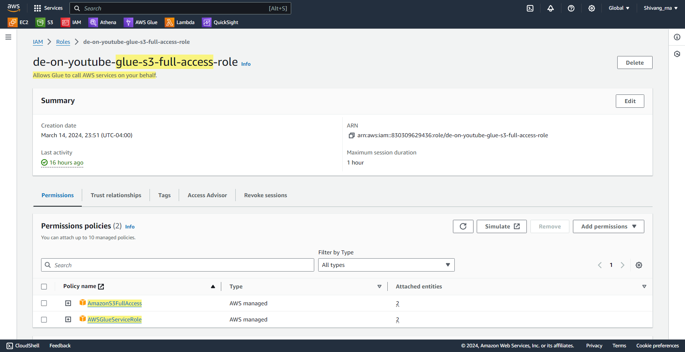
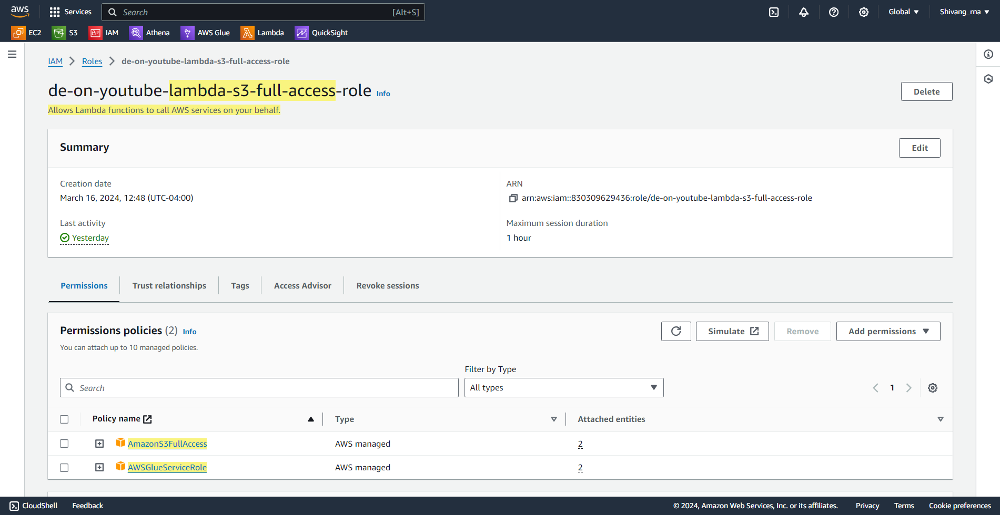
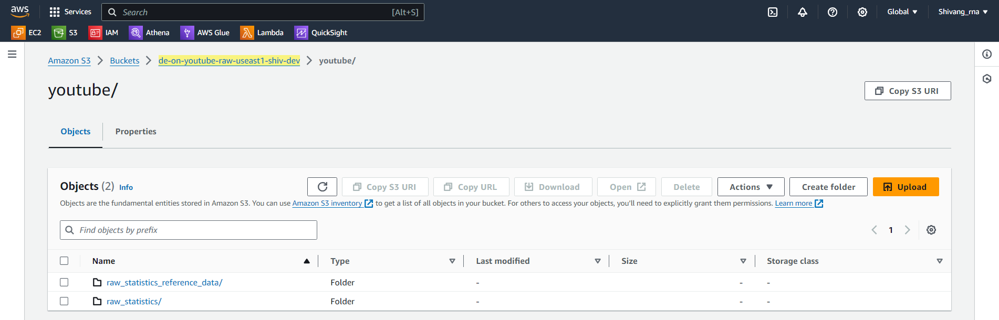
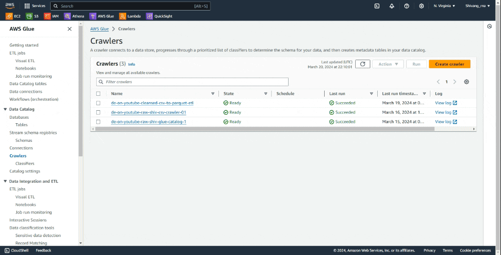
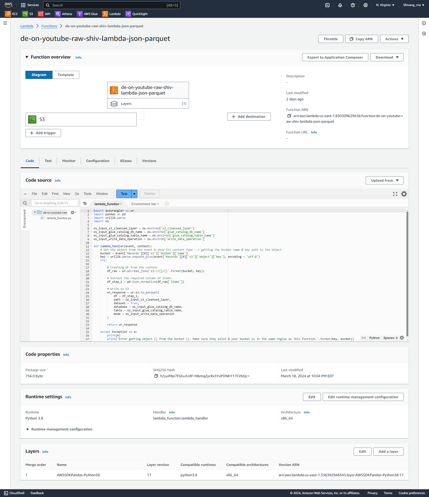
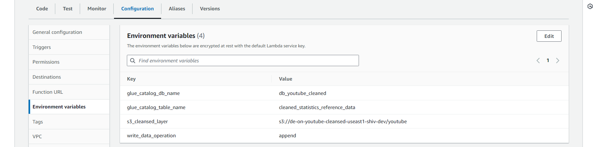
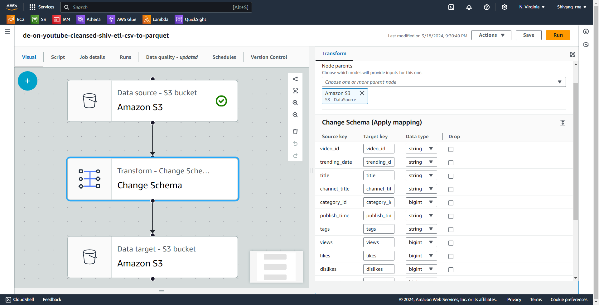
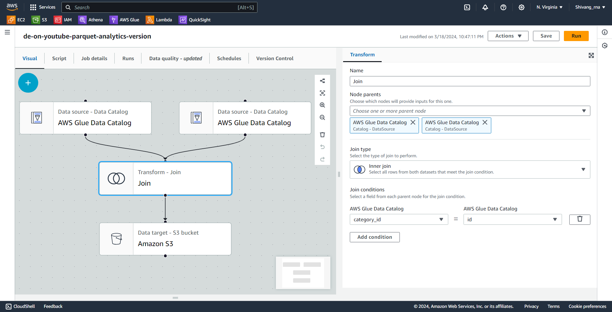

# Youtube-Data-Engineering-Pipeline 📺
## 📝 Overview
Embark on a transformative journey with the YouTube Data Engineering Pipeline repository! This project offers a robust solution meticulously crafted to efficiently manage, process, and analyze YouTube video data leveraging the power of AWS services. Whether you're diving into structured statistics or exploring the nuances of trending key metrics, this pipeline is engineered to handle it all with finesse.

## 🎯 Pipeline Goals
- **Data Ingestion**: Forge a resilient data ingestion mechanism capable of harmonizing data from disparate sources, prioritizing reliability.
- **ETL Excellence**: Engineer an Extract, Transform, Load (ETL) system to streamline the transformation of raw data into a standardized format.
- **Data Lake Mastery**: Establish a centralized data repository leveraging Amazon S3, ensuring optimal efficiency in housing diverse datasets.
- **Scalability**: Architect the system to seamlessly scale alongside burgeoning data volumes, guaranteeing uninterrupted performance.
- **Cloud Empowerment**: Harness the prowess of AWS cloud infrastructure to efficiently process and analyze extensive datasets.
- **Insightful Reporting**: Craft interactive dashboards in Amazon QuickSight, for visualization & analysis to drive informed decision-making.

## 📂 Dataset
The project utilizes a Kaggle dataset containing statistics on daily popular YouTube videos. 
- There are up to 200 trending videos published every day for many locations. 
- The data for each region is in its own file.
  
Each file includes metadata such as video title, channel title, publication time, tags, views, likes, dislikes, description, comment count, and category ID. The data also includes a category_id field, which varies between regions. To retrieve the categories for a specific video, find it in the associated JSON. One such file is included for each of the regions in the dataset. This dataset is been updated daily.

[Dataset Source](https://www.kaggle.com/datasets/rsrishav/youtube-trending-video-dataset)

## 🏗 Architecture Overview:
<p align="center">
    
</p>

## ⚙ Technology Stack
1. **Amazon S3 (Simple Storage Service)**: Primary data lake solution with scalable, durable, and secure object storage. Leverages RESTful API, multi-region replication, versioning, and lifecycle policies.
2. **AWS IAM (Identity and Access Management)**: Robust identity and access management controls safeguard resources through least privilege access, fine-grained policies, role-based access control (RBAC), and temporary security credentials.
3. **Amazon QuickSight**: Cloud-native business intelligence tool enabling interactive exploration and visualization of data. Leverages in-memory engine, SPICE architecture, and integration with AWS data sources for seamless ingestion and analysis.
4. **AWS Glue**: Fully managed ETL service automating data discovery, transformation, and integration. Features dynamic data catalog, schema inference, serverless architecture, and seamless integration with Amazon S3 and Athena.
5. **AWS Lambda**: Powers serverless computing infrastructure for event-driven data processing and analysis. Executes code in response to triggers, with pay-per-use pricing, automatic scaling, and seamless integration with other AWS services.
6. **Amazon Athena**: Interactive query service for analyzing data stored in Amazon S3 using standard SQL. Features distributed query processing engine, serverless architecture, and integration with AWS Glue data catalog for rapid insights generation.

## 👨‍💻 Workflow:
### AWS IAM User and Role Setup
- **Description**: Create an IAM user with appropriate permissions and attach a role for accessing AWS services.
- **Technical Details**:
  - Log in to the AWS Management Console.
  - Navigate to the IAM dashboard and create a new IAM user.
  - Attach policies granting permissions to access required AWS services (e.g., S3, Glue).
  - Create an IAM role with necessary permissions for the AWS Glue service to access S3.
  - Create an IAM role with necessary permissions for AWS lambda to access S3 and Glue service.
<p align="center">
    
</p>
<p align="center">
    
</p>

### AWS CLI Setup
- **Description**: Install and configure the AWS Command Line Interface (CLI) for interacting with AWS services programmatically.
- **Technical Details**:
  - Install the AWS CLI on local machine or codespace using the appropriate method for your operating system.
  - Configure the AWS CLI with credentials of the IAM user created in the previous step.
  - Set the default AWS region and output format for the AWS CLI.

### Data Ingestion
- **Description**: Data from YouTube is collected and stored in AWS S3 buckets.
- **Technical Details**:
  - Use AWS CLI to upload data files to S3 buckets.
  - Organize data files within S3 buckets according to a specified naming convention.
```
bash AWS_S3_CLI_command.sh
```
<p align="center">
    
</p>

### Data Schema Understanding for both JSON & CSV files
- **Description**: Use AWS Glue crawler to explore raw data stored in S3 buckets and create a database with tables.
- **Technical Details**:
  - Configure AWS Glue crawler to crawl S3 bucket path containing raw data reference JSON files.
  - Run the Glue crawler to discover schema and create a database with a table based on the JSON files.
  - Configure second AWS GLue crawler to crawl S3 bucket path containing raw data CSV files.
  - Run the Glue crawler to discover schema and create a database with a table based on the CSV files.
  - This will generate partition key of `region` automatically as we have stored the data file in such directory tree format
<p align="center">
    
</p>

### Solving JSON format error using AWS Lambda
- **Description**: Resolve issues with JSON file format not accepted by AWS services according to JSONSerDe Library; thereby converting JSON files to Parquet format.
- **Technical Details**:
  - Create a light ETL job using AWS Lambda to convert JSON files to Parquet format.
  - Setup Environment Variables for configuring S3 cleansed layer path, glue catalog database, and table name along with type of write data operation ("APPEND")
  - Add AWS Lambda layer of "AWSSDKPandas-Python38" to get the compute environment with the required packages & dependencies installed
  - Change the timeout time and memory requirement in configuration
  - Implement necessary data transformations and extracting only required column in the Lambda function `AWS_lambda_function.py`
  - Configure test event to check for one json file first using s3-put event test by providing the bucket and key (file path).
  - Create Trigger on the S3 bucket path , use event type of `all object create events`, prefix as bucket-key and suffix as `json`.
<p align="center">
    
</p>
<p align="center">
    
</p>

### Updating the datatype of id in cleansed reference data
- **Description**: When we generate the parquet file for reference data using lambda, the datatype of 'id' is converted into string, but we need it as bigint for joining the table with raw data.
- **Technical Details**:
  - Update the datetype to bigint in glue catalog table schema
  - Run the AWS lambda query again as it is an "APPEND" write function it will automatically update the datatype format for the generated 'id' in the parquet file to bigint
 
### Create AWS Glue ETL job for CSV files in raw data
- **Description**: Creating Glue ETL job that will convert the csv file to the parquet format for the raw data S3 bucket path
- **Technical Details**:
  - Create Glue Job with Data source as S3 or glue data catalog table (from csv crawler database glue table)
  - Then will connect the data source block to the Transform: Change schema block, where we update the schema for selected fields
  - For output data target S3 bucket is selected with format of parquet
  - Make sure to attach the IAM role of Glue service created previously
  - Use `AWS_GLUE_ETL_pyspark_code.py` script for selecting only few regions with paritioned individual parquet files in `region` folder format
  - Update the partition key of the output parquet file to "region"
  - If script is not used, then only a single parquet file is created for all csv files, without proper partitioning of subfolders with regions
<p align="center">
    
</p>

### Create AWS Glue crawler for the cleansed parquet files of raw data
- **Description**: Use AWS Glue crawler to explore cleansed parquet files from csv in S3 buckets and create a database with tables.
- **Technical Details**:
  - Configure AWS Glue crawler to crawl S3 bucket path containing data parquet (generated from etl job-csv files) cleansed files.
  - Run the Glue crawler to discover schema and create a database with a table based on them.

### Create AWS Glue ETL job for joining cleansed parquet data catalogs
- **Description**: Creating Glue ETL job that will join AWS glue data catalog of cleansed CSV-parquet files & reference JSON-parquet files
- **Technical Details**:
  - Create Glue Job with 2 Data source as AWS glue data catalogs 
  - Then will connect the 2 data source block to the Transform: Inner Join, where condition will be `category_id` from `CSV-parquet glue data catalog` should be equal to `id` from reference `JSON-parquet glue data catalog`
  - For output data target S3 bucket for analytics is created with format of parquet and attach it with new database.
  - Create database in Glue for analytics that will save the info of the joined table.
  - Use Partition keys of region and category_id
  - Update the partition key of the output parquet file to "region"
  - Make sure to attach the IAM role of Glue service created previously
<p align="center">
    
</p>
 
### Reporting on AWS QuickSight & Querying on AWS Athena
- **Description**: Develop a dashboard for visualizing insights and trends in the data. Use SQL query to understand the data.
- **Technical Details**:
  - Use AWS Athena to query data stored in the Glue data Catalog made for Analytics.
  - Create interactive dashboard in AWS Quicksight to generate visualizations & observe key-metrics for running advertisement campaigns on better performing youtube videos.

  
## 👋 Connect with Me
Let's connect and continue the conversation! Feel free to reach out to me via my socials below to share your thoughts, insights, and experiences with this modern AWS Data Engineering Pipeline. I look forward to connecting with fellow AWS enthusiasts and data engineering enthusiasts for ideas to improve this project! 

[](https://www.linkedin.com/in/sr099/) [](https://twitter.com/wtfisshivang)

---
*This project demonstrates a robust data engineering pipeline leveraging AWS services and modern data engineering tools to analyze and visualize trending YouTube data effectively.*


